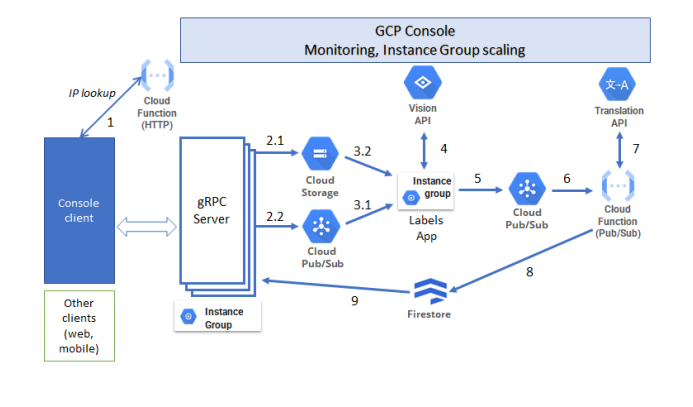

# Cloud project
### 1. The objective is to create a robust system to label images and translate those labels to users

The system follows the following figure:

<table>
  <tr>
    <td></td>
</tr>
  <tr>
    <td style="text-align: center;"><em>1. System components architecture</em></td>
  </tr>
</table>

The system components are:
- **gRPC protocol** for communication between client and server.
- Servers are hosted in an **Instance Group**.
- **Cloud Storage** to store the images sent by the user.
- **Pub/Sub** for the LabelsApp to know that it needs to process an image.
- **Cloud Function** to translate the labels.
- **Firestore** to store the resulting labels and translations.
